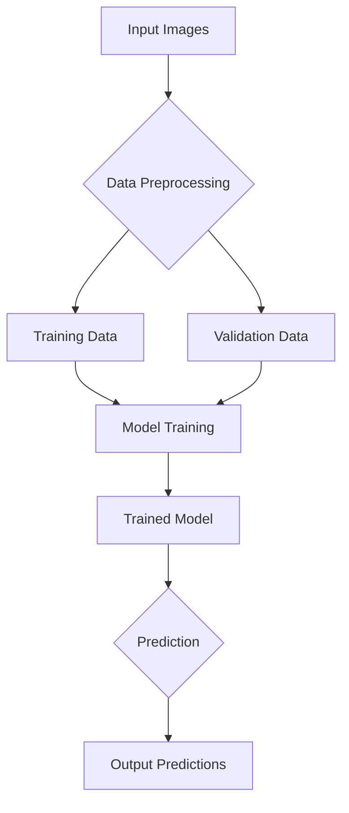

# System Patterns: Crop Stress Detection Project

## System Architecture

The Crop Stress Detection project follows a typical machine learning pipeline architecture for image classification:

*   **Input Images:** Raw image data of crops, potentially organized into directories representing different stress categories (e.g., healthy, nutrient deficiency, drought).
*   **Data Preprocessing:** Handled by `data_preprocessing.py`. This involves loading images, resizing, normalization, and potentially data augmentation to prepare them for model consumption.
*   **Training Data / Validation Data:** Split from the preprocessed data, used for training and evaluating the model's performance during development.
*   **Model Training:** Implemented in `train.py`. This script builds, compiles, and trains the deep learning model using the prepared datasets. It saves the trained model and the best performing model.
*   **Trained Model:** The output of the training phase, typically a `.h5` file containing the model's architecture and learned weights.
*   **Prediction:** Implemented in `predict.py`. This script loads a trained model and uses it to classify new, unseen images.
*   **Output Predictions:** The results of the prediction, which could be class labels, confidence scores, or annotated images.

## Key Technical Decisions

*   **Deep Learning for Image Classification:** Utilizing Convolutional Neural Networks (CNNs) as the core model architecture due to their effectiveness in image recognition tasks.
*   **Transfer Learning:** Likely employing pre-trained CNN models (e.g., from TensorFlow's Keras Applications) to leverage features learned from large datasets like ImageNet, which helps in achieving high accuracy with smaller, domain-specific datasets.
*   **Python Ecosystem:** Leveraging Python's rich ecosystem for machine learning, including libraries like TensorFlow/Keras for deep learning, NumPy for numerical operations, Pandas for data handling, and OpenCV/Pillow for image processing.
*   **Virtual Environments:** Recommending and using virtual environments (`venv`) for dependency management to ensure project reproducibility and avoid conflicts.

## Design Patterns in Use

*   **Modular Design:** The project is structured into distinct modules (`src/`, `data/`, `models/`, `docs/`, `output/`, `notebooks/`) with clear responsibilities, promoting maintainability and scalability.
*   **Configuration via Command-Line Arguments:** Scripts like `train.py` and `predict.py` accept parameters via command-line arguments, allowing for flexible execution and experimentation without modifying the code directly.
*   **Separation of Concerns:**
    *   `data_preprocessing.py`: Handles data-related logic.
    *   `model_utils.py`: Contains reusable model building and utility functions.
    *   `train.py`: Orchestrates the training process.
    *   `predict.py`: Handles inference.

## Component Relationships

*   `train.py` depends on `data_preprocessing.py` (for data loading) and `model_utils.py` (for model definition and utilities).
*   `predict.py` depends on the trained models saved by `train.py` and may use `data_preprocessing.py` for consistent image preparation.
*   `requirements.txt` defines all external dependencies for the entire system.
